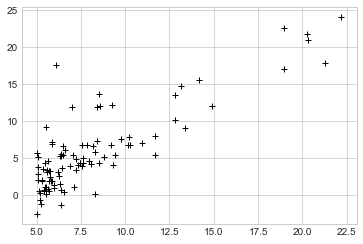
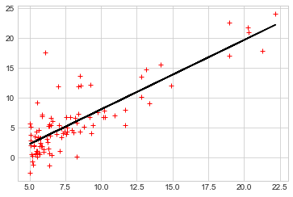
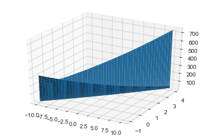
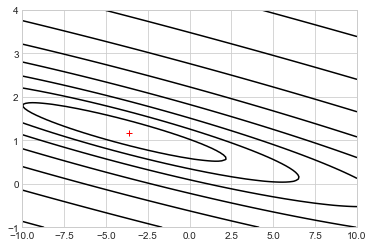
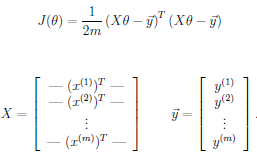
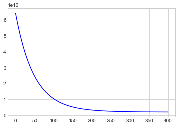
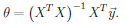

# Machine Learning Linear Regression Practice

1. Linear regression with one variable
Implement linear regression with one variable to predict profits for a food truck. 
Considering different cities for opening a new outlet. The chain already has trucks in various cities and have data for profits and populations from the cities. Using this data to help you select which city to expand to next.

2. Linear regression with multiple variables
Implement linear regression with multiple variables to predict the prices of houses. Suppose you are selling your house and wanting to know what a good market price would be. One way to do this is to first collect information on recent houses sold and make a model of housing prices.
## Plotting the Data


```python
import numpy as np
from pylab import plot
%matplotlib inline
import matplotlib.pyplot as plt
plt.style.use('seaborn-whitegrid')
```


```python
data = np.loadtxt("data/ex1data1.txt", delimiter=',')
```


```python
X = data[:,0]
y = data[:, 1]
m = len(y)
```


```python
plt.plot(X,y, 'r+', color='black')
```


    [<matplotlib.lines.Line2D at 0x26034fa9a90>]


    

    


## Part 3: Cost and Gradient descent


```python
X = np.hstack((np.ones((m,1)),X.reshape(m,1)))
y = y.reshape(m,1)
theta = np.zeros((2,1))
iterations = 1500
alpha = 0.01
```

#### Computing the cost J(theta)


```python
def computeCost(X, y, theta):
# """ COMPUTECOST(X, y, theta) computes the cost of using theta as the
#     parameter for linear regression to fit the data points in X and y """ 
    m = len(y)
    h = np.dot(X, theta)
    J = np.subtract(h, y)
    J = np.power(J,2)
    J = np.sum(J)
    J = (1/(2*m))*J
    return J
```


```python
J = computeCost(X,y,theta)
```


```python
J
```


    32.072733877455676


```python
J = computeCost(X,y,[[-1],[2]])
```


```python
J
```


    54.24245508201238


#### Gradient descent


```python
def gradientDescent(X, y, theta, alpha, num_iters):
#     """
#     GRADIENTDESCENT Performs gradient descent to learn theta
#    theta = GRADIENTDESCENT(X, y, theta, alpha, num_iters) updates theta by 
#    taking num_iters gradient steps with learning rate alpha
#     """
    m = len(y)
    J_history = np.zeros((num_iters, 1))
    for i in range(num_iters):
        temp0 = theta[0] - (alpha * (1/m) * np.sum(np.subtract(np.dot(X, theta), y)))
        temp1 = theta[1] - (alpha * (1/m) * np.sum(np.multiply(np.subtract(np.dot(X, theta), y),X[:,1].reshape(m,1))))
        theta[0] = temp0
        theta[1] = temp1
        
        J_history[i] = computeCost(X, y, theta)
        
    return (theta, J_history)    
```


```python
theta, J_history = gradientDescent(X, y, theta, alpha, iterations)
```


```python
theta
```


    array([[-3.63029144],
           [ 1.16636235]])


```python
plt.plot(X[:,1],y, 'r+')
plt.plot(X[:,1], np.dot(X,theta), color='black')
plt.show()
```


    

    


```python
predict1 = [1,3.5] @ theta
predict2 = [1,7] @ theta
print(predict1, predict2)
```

    [0.45197679] [4.53424501]
    

## Visualizing J(theta_0, theta_1)


```python
theta0_vals = np.linspace(-10, 10, 100)
theta1_vals = np.linspace(-1, 4, 100)
```


```python
J_vals = np.zeros((len(theta0_vals), len(theta1_vals)))
```


```python
for i in range(len(theta0_vals)):
    for j in range(len(theta1_vals)):
        t = np.array([[theta0_vals[i], theta1_vals[j]]]).T
        J_vals[i][j] = computeCost(X, y, t)
```


```python
J_vals = J_vals.T
```


```python
J_vals
```


    array([[328.09290555, 323.26504192, 318.47799046, ...,  49.81156018,
             48.94247627,  48.11420452],
           [316.6648683 , 311.92025945, 307.21646275, ...,  46.45923561,
             45.67340647,  44.9283895 ],
           [305.44447299, 300.7831189 , 296.16257698, ...,  43.31455298,
             42.61197861,  41.95021641],
           ...,
           [186.35412584, 189.60197489, 192.89063611, ..., 691.41691065,
            698.62353943, 705.87098036],
           [195.06735595, 198.39845977, 201.77037576, ..., 708.20585345,
            715.49573699, 722.82643269],
           [203.98822799, 207.40258658, 210.85775734, ..., 725.20243817,
            732.57557648, 739.98952696]])


```python
from mpl_toolkits.mplot3d import Axes3D
from matplotlib import cm
import matplotlib.pyplot as plt
import matplotlib
from pylab import *
import numpy as np

fig = plt.figure()
ax = fig.gca(projection='3d')

# choose any colormap e.g. cm.jet, cm.coolwarm, etc.
# color_map = cm.RdYlGn # reverse the colormap: cm.RdYlGn_r
# scalarMap = cm.ScalarMappable(norm=Normalize(vmin=min, vmax=max), cmap=color_map)
#Create X and Y data
# x = np.arange(xmin, xmax, xstep)
# y = np.arange(ymin, ymax, ystep)
# X, Y = np.meshgrid(x, y)
# C = scalarMap.to_rgba(J_vals)

# surf = ax.plot_surface(theta0_vals, theta1_vals, J_vals, rstride=1, facecolors=C, cstride=1, antialiased=True)
# surf = ax.plot_surface(theta0_vals, theta1_vals, J_vals, rstride=1, cstride=1, antialiased=True)
surf = ax.plot_surface(theta0_vals, theta1_vals, J_vals)

#Show the plot
plt.show()


```


    

    


```python
plt.contour(theta0_vals, theta1_vals, J_vals, np.logspace(-2, 3, 20), colors='black')
plt.plot(theta[0], theta[1], 'r+')
plt.show()
```


    

    


```python
theta
```


    array([[-3.63029144],
           [ 1.16636235]])


## Linear regression with multiple variables


```python
import numpy as np
data = np.loadtxt("data/ex1data2.txt", delimiter=',')
```


```python
X = data[:,0:2]
y = data[:, 2][newaxis].T
m = len(y)
```

#### Feature Normalization


```python
def featureNormalize(X):
    mu = np.mean(X, axis=0)
    sigma = np.std(X, axis=0)
    X_norm = np.divide(np.subtract(X, mu), sigma)
    
    return (X_norm, mu, sigma)
```


```python
X, mu, sigma = featureNormalize(X)
```


```python
X = np.hstack((np.ones((m,1)),X))
```


```python
alpha = 0.01
num_iters = 400
```


```python
theta = np.zeros((3,1))
```




```python
def computeCostMulti(X, y, theta):
    m = len(y)
    J = (1.0/(2*m))*(X@theta - y).T @ (X@theta - y)
    return J
```


```python
def gradientDescentMulti(X, y, theta, alpha, num_iters):
    m = len(y)
    J_history = np.zeros((num_iters, 1))
    for i in range(num_iters):
        theta = theta - (alpha * (1/m) *np.sum(np.multiply((X@theta -y),X),axis=0))[newaxis].T
        J_history[i] = computeCostMulti(X, y, theta)
    return (theta, J_history)
```


```python
(theta, J_history) = gradientDescentMulti(X, y, theta, alpha, num_iters)
```


```python
theta
```


    array([[334302.06399328],
           [ 99411.44947359],
           [  3267.01285407]])


```python
plt.plot(range(len(J_history)), J_history, '-b')
plt.show()
```


    

    


```python
d = np.array([1650,3])
d = (d - mu)/sigma
d = np.hstack((np.ones(1),d))
price = d @ theta
```


```python
price = d @ theta
```


```python
price
```


    array([289221.54737122])


## Normal Equations





```python
def normalEqn(X, y):
    return linalg.pinv((X.T @ X)) @ (X.T @ y)
```


```python
theta = normalEqn(X,y)
```


```python
theta
```


    array([[89597.90954355],
           [  139.21067402],
           [-8738.01911255]])


```python
d = np.array([1,1650,3])

price = d @ theta
```


```python
price
```


    array([293081.46433497])


